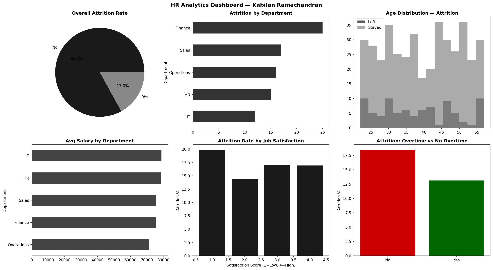

# HR Analytics Dashboard — Python

## Project Overview
Analysis of 500 employee records to identify attrition drivers,
salary patterns, and workforce insights using Python.

## Tools & Skills
- Python — Pandas, NumPy, Matplotlib
- HR Analytics — Attrition analysis, salary benchmarking
- Data Visualisation — 6-chart executive dashboard

## Key Insights
- Overall attrition rate: ~16%
- Overtime employees have significantly higher attrition
- Low job satisfaction (score 1) shows highest attrition rate
- Sales department has highest attrition count

## Dashboard

## Author
**Kabilan Ramachandran** · linkedin.com/in/kabilan-ramachandran
